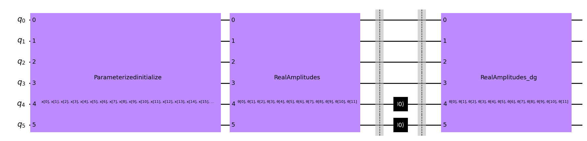
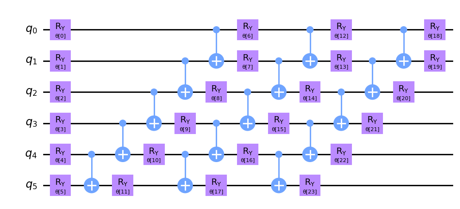
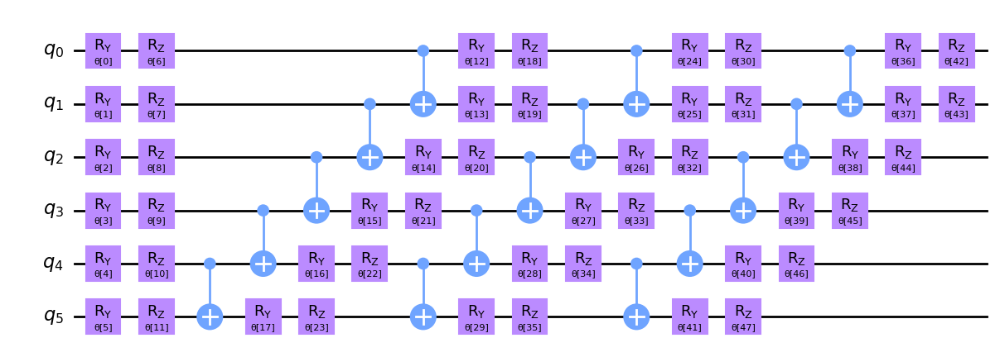
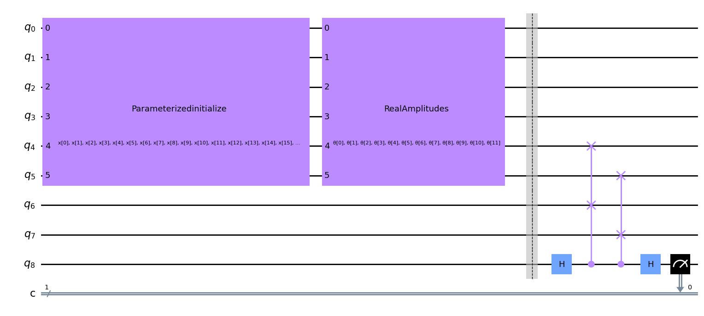
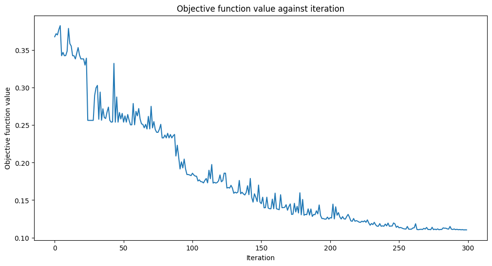
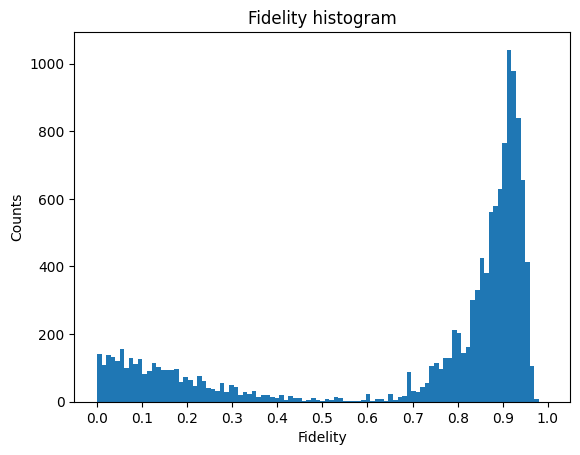
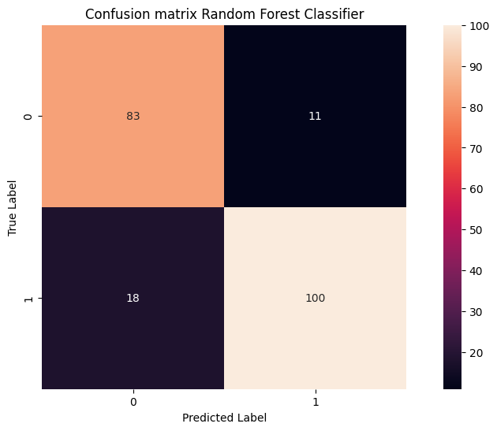

# MNIST handwritten digits classification problem using a Quantum Autoencoder
This is an examination project on Quantum Machine Learning done for the course of "Quantum Computing and Technologies" at University of Pisa. The goal was to solve the classification problem of the MNIST database of handwritten digits using a Quantum Autoencoder.

# Table of contents
1. [The MNIST database](#The-MNIST-database)
   1. [Isomap](#Isomap)
2. [Classical ML Classifiers](#Classical-ML-Classifiers)
   1. [Gaussian Classifier](#Gaussian-Classifier)
   2. [Random Forest Classifier](#Random-Forest-Classifier)
3. [PCA Reduction](#PCA-reduction)
4. [Quantum Autoencoder](#quantum-autoencoder)
   1. [Ansatz](#ansatz)
   2. [Loss function](#loss-function)
   3. [Swap Test](#swap-test)
   4. [Results](#results)

## The MNIST database
The MNIST database is a database of 70000 handwritten digits. We can import it and divide in two sets. The first set consisting of 60000 images will be used as the train set and the remaining 10000 images will be used as the test set. 

Let's take a look at some of the images contained in the database:

### Isomap
Each image in the database is 28 x 28 = 784 pixels. We treat each pixel in the images as a feature, thus we have 784 features. It is difficult to visualize our data points in a 784-dimensional parameter space so we make use of the manifold learning algorithm _Isomap_ to reduce the dimensionality to 2 and gain more insight on the structure of the database.

Here is the plot of 1/20 of the database in the 2-dimensional parameter space

We can plot singularly every digit to understand the variety of forms that the digits can take, here is the plot of the 1's in the 2D parameter space.

This result gives us an insight of the variety of different forms that the number "1" can take inside the database, the same applies to the othe digits.

## Classical ML Classifiers
We try some Classical ML Classifiers to compare then the results with our Quantum Classifier.

### Gaussian Naive Bayes Classifier 

As a first try we use a Gaussian Naive Bayes Classifier, which works under the assumpion that the data from each classes are derived from a Gaussian distribution. Of course this could not be the case, in fact we obtain very poor result:

 Accuracy score = 0.5558 

We can plot the confusion matrix to better understand the errors made by this classifier.

As we can see many digits are misclassified by this simple method.

### Random Forest Classifier 
A more sophisticated method is to use a Random Forest Classifier, an ensamble learner built on decision trees. This time we obtain good result:

 | Class | Precision | Recall | f1-score | Support |
 |:---:  | :---      | :---   | :---:    | :---:   | 
 | 0     |     0.99  |   0.97 |    0.98  |   997   | 
 | 1     |     0.99  |   0.99 |    0.99  |  1134   | 
 | 2     |     0.97  |   0.96 |    0.97  |  1039   | 
 | 3     |     0.97  |   0.96 |    0.97  |  1014   | 
 | 4     |     0.97  |   0.98 |    0.98  |   979   |
 | 5     |     0.97  |   0.98 |    0.97  |   880   |
 | 6     |     0.98  |   0.98 |    0.98  |   962   |
 | 7     |     0.97  |   0.97 |    0.97  |  1023   |
 | 8     |     0.96  |   0.96 |    0.96  |   967   |
 | 9     |     0.95  |   0.96 |    0.96  |  1005   |

As before we plot the confusion matrix, this time we can see that the grat majority of digits are correctly classified.

## PCA reduction 
To reduce the dimensionality of the dataset we make use of the Principal Component Analysis to quantify the relationship among the data and find a list of the principal axes in the data. Fitting with this method returns the _components_ and the _explained variance_. The _components_ can be seen as the directions of the vectors (principal axes) in the parameter space and the _explained variance_ as the squared-length of these vectors (measures how important an axes is in describing the distribution of the data). Thus PCA allow us to zeroing out the smallest principal components and reduce the dimensionality of our dataset.
If we think of every images as an array of 784 pixels we can write a "basis" for this space in the form of

$image(x) = x_1 \cdot (pixel \space 1) + x_2 \cdot (pixel \space 2) + \cdots + x_{784} \cdot (pixel \space 784)$.

We can think of a different basis like

$image(x) = mean  + x_1 \cdot (basis \space 1) + \cdots + x_{784} \cdot (basis \space 784)$.

PCA can be thought as a process that allows us to choose  optimal basis functions, such that some of them alone are enought to reconstruct the original image.

To estimate how many components do we need to suitably describe the data we plot the comulative _explained variance ratio_ as a function of the number of components.

As we can see from the images about 100 components are needed to retain 90% of the variance, thus loosing about 10% of the original information.
To see this we compare three images: the image on the left is the original digit in the database, the central images is the digit reduced with PCA to 64 features and then reconstructed, the images on the right is the same digit reduced with PCA to 128 features and then reconstructed.

  
   
  

It is clear that the image is quite well reconstructed and we do not loose too much information reducing the database from 784 features to 128 or 64 features.

## Quantum Autoencoder

A Quantum Autoencoder is a type of neural network that allow us to reduce the dimensionality of the input, in this case a quantum state. It consist of three layers, the input layer, the bottleneck layer and the output layer. 
In the first layer we encode the pixel via amplitude encoding into a feature map *Parametrized Initialize*. Then we apply the encoder, in this case the parametrized circuit *RealAmplitudes*. After that the dimensionality of our quantum state is reduced and we disregard some of the qubits inizializing them to $\ket{0}$. The final layer consist in applying the decoder (the hermitian conjugate of the encoder) and reconstruct the original input state.

### Ansatz
The ansatz is the parametrized quantum circuit we choose as the encoder. The parameters of this cicuit acts as the weights of the neural network and after each iteration will be updated to optimize the loss function. There are several possibilities, here we make use of the *RealAmplitudes* and *EfficientSU2* circuits. It is also possible to repeate the circuit several times in order to have a greater number of parameters, thus more flexibility in the training process.

RealAmplitudes:

EfficientSU2:

As we can see both *RealAmplitudes* and *EfficientSU2* consist of combination of 1 qubit gates (rotation) and 2 qubit gates to entangle the various qubits.

### Loss Function
Our goal is to maximize the fidelity between the input state and the output state:

$max \space F(\rho_{in},\rho_{out})$.

To do so we apply a swap test between the reference space and the latent space, and then we measure the ancilla qubit, as can be seen by the figure below.

### Swap Test
The swap test is a procedure that allows us to compute the absolute square of the inner product of two quantum states from the probability of measuring an ancilla qubit.
Suppose we have a quantum state that is the tensor product of two qubit register plus an ancilla qubit

$\ket{0}\otimes \ket{i}\otimes \ket{j} = \ket{0}\ket{i}\ket{j}$.

Applying the hadamard gate to the ancilla qubit leads to

$\frac{1}{\sqrt{2}}(\ket{0}+\ket{1})\ket{i}\ket{j}$.

After the controlled swap gate the state become

$\frac{1}{\sqrt{2}}(\ket{0}\ket{i}\ket{j}+\ket{1}\ket{j}\ket{i})$.

Then we apply another Hadamard gate to the ancilla and we obtain the state

$\ket{\psi}=\frac{1}{2}\ket{0}\otimes (\ket{i}\ket{j}+\ket{j}\ket{i})+\frac{1}{2}\ket{1}\otimes (\ket{i}\ket{j}-\ket{j}\ket{i})$.

Thus the probability of measuring the ancilla qubit in the state $0$,  $p_0=|(\bra{0}\otimes \mathbb{I})\ket{\psi}|^2$ is given by

$p_0 = \frac{1}{2}+\frac{1}{2}|\braket{i|j}|^2$

Thus we can obtain the overlap of the two states as

$|\braket{i|j}|^2=2p_0-1$.

### Results
The training process takes a long time, for this reason we initially limit ourselves to considering only the zeros and ones and select only $1/50$ of that images. This leaves us with about $250$ images to use in the training process.

Here's an example of optimization routine. As we can see after many iteration the training converges and we can extract the optimal parameters that minimize the loss function.

Below are two tables that summarizes the results of the autoencoder training. In particular we are intrested in the highest value of the fidelity.

|RealAmplitudes rep. | Fidelity | Training time | Iteration |
|     :---:          | :---:    |   :----:      | :---:     |
| 1                  | 0.739    | 10 min        | 250       |
| 2                  | 0.627    | 12 min        | 250       |
| 3                  | 0.743    | 15 min        | 250       |
| 4                  | 0.777    | 24 min        | 300       |
| 5                  | 0.696    | 29 min        | 400       |
 
 

|EfficientSU2 rep. | Fidelity | Training time | Iteration |
|     :---:        | :---:    |   :----:      | :---:     |
| 1                | 0.559    | 19 min        | 350       |
| 3                | 0.604    | 20 min        | 250       |

These fidelity values can change every time we go to recalculate this function, given the probabilistic nature of the process.
For this reason we calculated the fidelity for each image several times, then building the histogram of the occurrences, in order to make explicit the distribution of the fidelity values.
This time we considered $1/10$ of the zeros and ones, thus about $1200$ images for the training process and about $250$ for the test process. As ansatz we used _RealAmplitudes_ with $1$ repetition.

As we can see the distribution is peaked around $0.9$ which meand that the majority of images are efficiently encoded. Now we can classify the encoded images (reduced from 784 to only 16 features) using a _Random Forest Classifier_.

 | Class | Precision | Recall | f1-score | Support |
 |:---:  | :---      | :---   | :---:    | :---:   | 
 | 0     |     0.86  |   0.82 |    0.84  |   99    | 
 | 1     |     0.85  |   0.88 |    0.87  |   113   | 

 

We can also plot the confusion matrix:

 

As we can see we get good results, which means that we were able to encode the images efficiently using our Quantum Autoencoder.