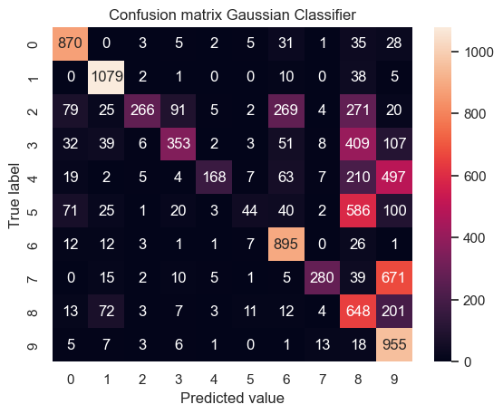

# Quantum Autoencoder
This is an ongoing examination project on Quantum Machine Learning. The goal is to solve the classification problem of the MNIST database of handwritten digits using a Quantum Autoencoder.

# Table of contents
1. [The MNIST database](#The-MNIST-database)
   1. [Isomap](#Isomap)
2. [Classical ML Classifiers](#Classical-ML-Classifiers)
   1. [Gaussian Classifier](#Gaussian-Classifier)
   2. [Random Forest Classifier](#Random-Forest-Classifier)
3. [PCA Reduction](#PCA-reduction)

Projected steps to complete the project:
1) Import the MNIST databse and take a look at it
2) Use some classical ML algorithm to solve the classification problem 
3) Reduce the dimensionality of the photos using PCA, maxpooling or average pooling
4) Figure it out how to encode and decode blocks of the images separately using a Quantum Autoencoder

## The MNIST database
The MNIST database is a database of 70000 handwritten digit. We can import it and divide in two sets. The first set consisting of 60000 images will be used as the train set and the remaining 10000 images will be used as the test set. 

Let's take a look at some of the images contained in the database:

### Isomap
Each image in the database is 28 x 28 = 784 pixels. We treat each pixel in the images as a feature, thus we have 784 features. It is difficult to visualize our data points in a 784-dimensional parameter space so we make use of the manifold learning algorithm _Isomap_ to reduce the dimensionality to 2 and gain more insight on the structure of the database.

Here is the plot of 1/20 of the database in the 2-dimensional parameter space

We can plot singularly every digit to understand the variety of forms that the digits can take, here is the plot of the 1's in the 2D parameter space.

## Classical ML Classifiers

### Gaussian Classifier 

### Random Forest Classifier 

## PCA reduction 
To reduce the dimensionality of the dataset we make use of the Principal Component Analysis to quantify the relationship among the data and find a list of the principal axes in the data. Fitting with this method returns the _components_ and the _explained variance_. The _components_ can be seen as the directions of the vectors (principal axes) in the parameter space and the _explained variance_ as the squared-length of these vectors (measures how important an axes is in describing the distribution of the data). Thus PCA allow us to zeroing out the smallest principal components and reduce the dimensionality of our dataset.
If we think of every images as an array of 784 pixels we can write a "basis" for this space in the form of:

$image(x) = x_1 \cdot (pixel \space 1) + x_2 \cdot (pixel \space 2) + \cdots + x_{784} \cdot (pixel \space 784)$.

We can think of a different basis like:

$image(x) = mean  + x_1 \cdot (basis \space 1) + \cdots + x_{784} \cdot (basis \space 784)$

PCA can be thought as a process that allows us to choose  optimal basis functions, such that some of them alone are enought to reconstruct the original image.

To estimate how many components do we need to suitably describe the data we plot the comulative _explained variance ratio_ as a function of the number of components.

As we see from the images about 100 components are needed to retain 90% of the variance, thus loosing about 10% of the original information.
To see this we compare three images: the image on the left is the original digit in the database, the central images is the digit reduced with PCA to 64 features and then reconstructed, the images on the right is the same digit reduced with PCA to 128 features and then reconstructed.

  
   
  

It is clear that the images is quite well reconstructed and we do not loose too much information reducing the database from 784 features to 128 features.